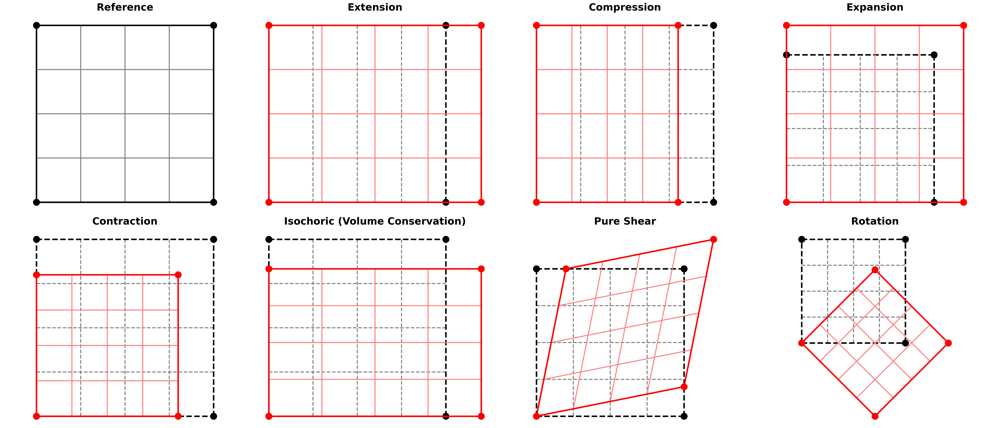

# Linear Transformation Demo

This repository provides an educational Python script to **visualize linear transformations** using 2D grids.  
It demonstrates how different transformations (extension, compression, shear, rotation, etc.) affect a structured meshgrid.  

The code uses [NumPy](https://numpy.org) for numerical operations and [Matplotlib](https://matplotlib.org) for visualization.  

## ✨ Features
- Plot structured grids with clear borders and corner markers.
- Apply custom 2×2 transformation matrices to grids.
- Compare original and transformed configurations side-by-side.
- Includes examples of common transformations:
  - Identity
  - Extension / Compression
  - Expansion / Contraction
  - Isochoric (volume-preserving)
  - Pure Shear
  - Rotation



## 📦 Requirements
- Python ≥ 3.8  
- [NumPy](https://numpy.org/)  
- [Matplotlib](https://matplotlib.org/)  

## ⚙️ Installation

### Using [uv](https://github.com/astral-sh/uv) (recommended)

```bash
uv sync
uv run python main.py
```

### Or using [pip](https://pip.pypa.io/en/stable/)

```bash
pip install numpy matplotlib
python main.py
```
